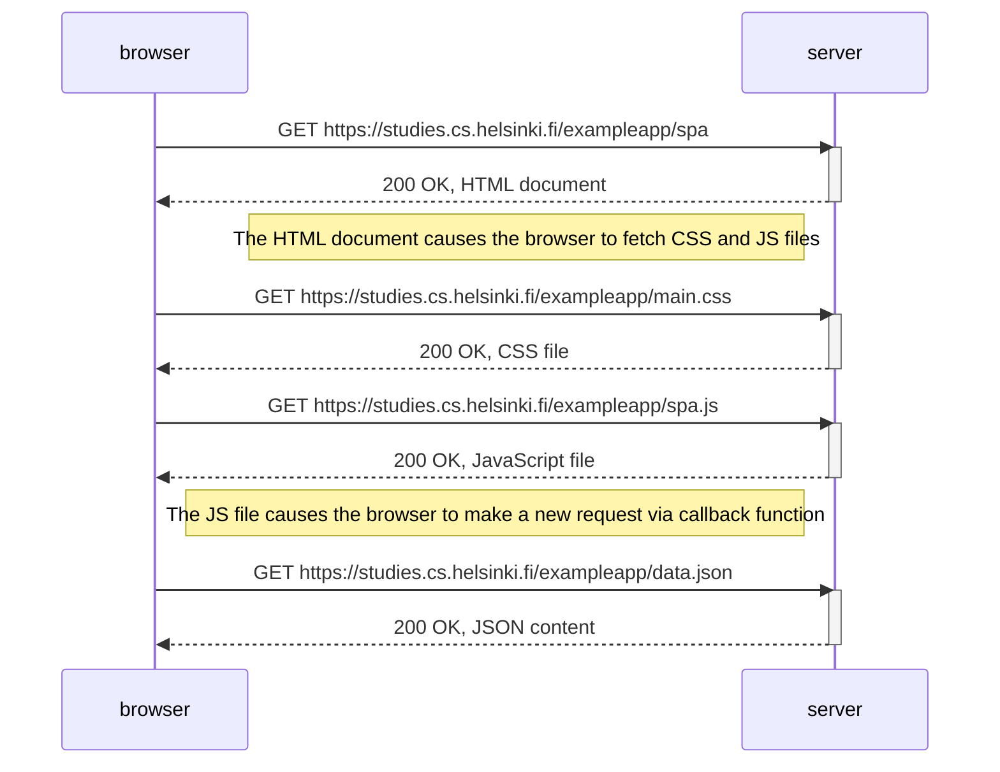

```mermaid
sequenceDiagram
    participant browser
    participant server

    browser->>server: GET https://studies.cs.helsinki.fi/exampleapp/spa  
    activate server
    server-->>browser: 200 OK, HTML document
    deactivate server
    Note left of server: The HTML document causes the browser to fetch CSS and JS files

    browser->>server: GET https://studies.cs.helsinki.fi/exampleapp/main.css  
    activate server
    server-->>browser: 200 OK, CSS file
    deactivate server

    browser->>server: GET https://studies.cs.helsinki.fi/exampleapp/spa.js  
    activate server
    server-->>browser: 200 OK, JavaScript file
    deactivate server
    Note left of server: The JS file causes the browser to make a new request via callback function

    browser->>server: GET https://studies.cs.helsinki.fi/exampleapp/data.json 
    activate server
    server-->>browser: 200 OK, JSON content
    deactivate server
```
